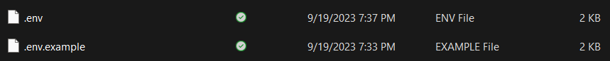

# Cara kolaborasi github
Cara kolaborasi github untuk berkolaborasi mengelola pekerjaan


## Untuk non Kontributor/Anggota

### 1. Copy link untuk clone


lalu jalankan perintah ini:

**git clone < url clone>**

```bash
$ git clone https://github.com/kelas-industri-kelompok-1/PresensiQRCode.git
```


 selanjutnya berpindah ke folder / directory yang telah di clone, dengan menggunakan perintah:

```bash
$ cd PresensiQRCode
```


setelah di dalam directory **PresensiQRCode** (sesuaikan dengan directory yang ada)

install vendor terlebih dahulu, dengan mejalankan perintah seperti berikut:

```bash
$ composer install
```


jika berhasil maka akan ada file baru dengan nama "**vendor**"


berikutnya copy file env dengan menggunakan perintah:

```bash
$ cp .env.example .env
```


kemudian akan ada file baru dengan nama ".env" dan ".env.example"


berikutnya generate app key, dengan menjalankan perintah sebagai berikut:

```bash
$ php artisan key:generate
```
jika berhasil maka akan tampil seperti gambar berikut:

> jika tampil seperti gambar, maka patch anda sudah sama dengan semua anggota lain

setelah itu aktifkan server laravelnya dengan menggunakan perintah:
```bash
$ php artisan serve
$ php artisan serv
$ php artisan ser
```
> bisa dipersingkat (pilih salah satu)

>jika sudah tampil seperti gambar, server laravel anda sudah bisa digunakan

kemudian, copy "**http://127.0.0.1:8000**" ke browser kalian untuk menjalankan tampilan antarmukanya

>tampilan default antarmuka laravel


